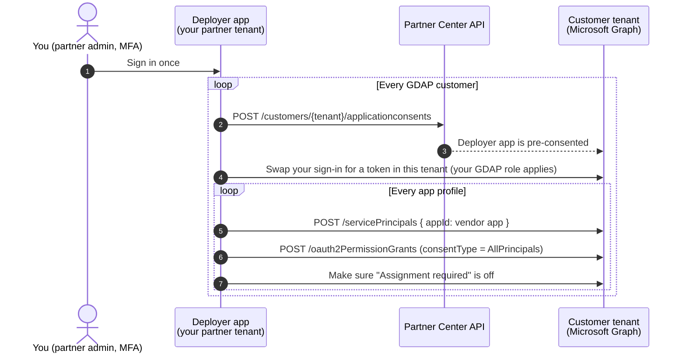

# CSP Enterprise App Deployment

Mass-deploy multi-tenant **enterprise apps** from your Microsoft **CSP partner tenant** into all of your GDAP-managed customer tenants, with tenant-wide admin consent, without logging in to each customer's tenant.

The typical use is a SaaS vendor's **"Sign in with Microsoft"** app: a PSA or ticketing client portal, a documentation or password tool, a backup or security product. Before anyone can use it, the vendor's app has to appear in each customer tenant and be consented. Doing that by hand means, for every customer:

1. Getting a user to try signing in, so the app shows up in their tenant.
2. Signing in to their tenant as a Global Admin and accepting the consent prompt.
3. Checking that users are actually allowed to use the app.

This toolkit does all three for every customer, and for as many apps as you like, in one run.

---

## Why "just script it with PowerShell" doesn't work

When a partner account uses an app inside a customer tenant through GDAP, Microsoft first checks that the app has been **authorized in that customer tenant**. If it hasn't, sign-in fails with:

> `AADSTS90099: The application '…' has not been authorized in the tenant '…'. Applications must be authorized to access the customer tenant before partner delegated administrators can use them.`

Microsoft Graph PowerShell is one of those apps, and so is the vendor app you're trying to deploy. A partner account also can't click through the normal consent prompt for a customer. That is the block most CSPs hit.

## How this works

Microsoft provides a Partner Center API, `POST /v1/customers/{tenant}/applicationconsents`, that pre-consents an app into a customer tenant. **It only works for an app registered in your own partner tenant.** The API requires the token to belong to the same app being consented, so you can't use it on a vendor's app directly.

So the toolkit takes two hops:



1. **Deployer app (one-time setup).** You register a small multi-tenant app in your partner tenant. It has delegated permissions only, and no client secret.
2. **Hop 1, Partner Center.** For each customer, the script calls `applicationconsents` to pre-consent the deployer app into that tenant. This fixes the `AADSTS90099` block.
3. **Hop 2, Microsoft Graph in the customer tenant.** Your single sign-in is exchanged for a token in the customer tenant. Then, for each app profile in `config/apps/`, the script:
   - **creates the vendor's enterprise app** (service principal) straight from its app ID, so nobody has to sign in to the app first;
   - **grants tenant-wide admin consent** for the scopes the app needs. This is exactly what "Accept on behalf of your organization" does;
   - sets **Assignment required = No**, so every user can sign in. This is configurable per app.

Every step checks first and only changes what's missing. That means you can re-run it any time, for example after onboarding a new customer or adding a new app profile.

## What you need

| Requirement | Why |
|---|---|
| A Microsoft **CSP partner tenant** with **GDAP** relationships to your customers | This is the trust the whole approach relies on |
| Your partner user is in the **AdminAgents** group (Partner Center *Admin agent* role) | Required to call any Partner Center API |
| **Cloud Application Administrator** *or* **Application Administrator** in each customer's GDAP relationship, assigned to a security group your user is in | Required by Microsoft for the consent API, and for creating enterprise apps and granting consent |
| MFA on your partner sign-in | Partner Center and GDAP both require it |
| PowerShell **7.2+** | The scripts use PowerShell 7 features |
| `Microsoft.Graph.Authentication` module (one-time setup only) | Used once to register the deployer app |

> **Check the GDAP roles first.** Many GDAP relationships were set up without Cloud Application Administrator, and you can't add a role to an existing relationship. Microsoft's recommended fix is a second, short-lived GDAP relationship (for example 1 day) that contains only Cloud Application Administrator. `Test-GdapReadiness.ps1` shows which customers are ready. See [docs/SETUP.md](docs/SETUP.md#1-check-gdap-roles).

**Scope:** apps that need delegated permissions (typical SSO / "Sign in with Microsoft" apps) are covered with Cloud Application Administrator. Apps that need Microsoft Graph *application* permissions also work, but need the deployer set up with `-IncludeAppRoleAssignment`, and **Privileged Role Administrator** in GDAP.

## Quick start

```powershell
# 1. One-time: register the deployer app in your partner tenant (run as partner Global Admin)
./scripts/New-DeployerApp.ps1 -PartnerTenantId yourmsp.onmicrosoft.com

# 2. See which customers' GDAP relationships have the role needed (read-only)
./scripts/Test-GdapReadiness.ps1

# 3. Create a profile for each app you want to deploy (written to config/apps/<name>.json).
#    Easiest: paste the Microsoft sign-in URL the app sends you to.
./scripts/New-TargetAppProfile.ps1 -DisplayName 'Contoso Portal' -LoginUrl 'https://login.microsoftonline.com/...authorize?client_id=...'

# 4. Pilot: preview, then deploy, to ONE tenant
./scripts/Invoke-AppDeployment.ps1 -TenantId <pilot-tenant-id> -WhatIf
./scripts/Invoke-AppDeployment.ps1 -TenantId <pilot-tenant-id>

# 5. Roll out every app in config/apps to every GDAP customer
./scripts/Invoke-AppDeployment.ps1 -WhatIf
./scripts/Invoke-AppDeployment.ps1
```

Each run writes a CSV report to `reports/`, one row per tenant per app, with the result, any error, and a hint for fixing it.

## Documentation

| Doc | Contents |
|---|---|
| [docs/SETUP.md](docs/SETUP.md) | Prerequisites, GDAP roles, creating the deployer app (script or portal), building app profiles |
| [docs/RUNBOOK.md](docs/RUNBOOK.md) | Pilot, full rollout, adding apps, onboarding new customers, verifying, rolling back, reading the report |
| [docs/TROUBLESHOOTING.md](docs/TROUBLESHOOTING.md) | Error codes and fixes |

## Repository layout

```
config/
  deployer.json               written by New-DeployerApp.ps1 (tenant ID + app ID, no secrets; git-ignored)
  apps/<name>.json            one profile per app to deploy (written by New-TargetAppProfile.ps1; git-ignored)
  app-profile.example.json    hand-editable example profile
scripts/
  New-DeployerApp.ps1         one-time: register the deployer app in the partner tenant
  Test-GdapReadiness.ps1      read-only: which customers have the GDAP role the rollout needs
  New-TargetAppProfile.ps1    build an app profile (from a sign-in URL, a reference tenant, or by hand)
  Invoke-AppDeployment.ps1    the rollout (supports -WhatIf / -Confirm, idempotent)
src/
  PartnerAppDeploy.psm1       shared sign-in, Graph and Partner Center helpers
reports/                      CSV output per run (git-ignored)
```

## Security notes

- **No stored secrets.** The deployer is a public client. Your refresh token lives in memory for the length of the run and is never written to disk.
- **Delegated permissions only.** The deployer can't do anything by itself. Every action runs as *you* and is limited by your GDAP roles in that tenant.
- **Least privilege in customer tenants.** Partner Center pushes only `Application.ReadWrite.All` and `DelegatedPermissionGrant.ReadWrite.All`, plus `AppRoleAssignment.ReadWrite.All` if you opt in. Use `-RemoveDeployerAfter` to remove the deployer from each customer once its apps are deployed. The next run adds it back automatically.
- **Optional hardening** in your partner tenant: on the deployer's enterprise app, turn on *Assignment required* and assign only the admins who run rollouts. Also cover it with a Conditional Access policy that requires MFA.
- **Only deploy apps you trust.** Granting tenant-wide consent approves the app for every user in the customer's tenant. Review each profile's scopes before rolling it out.

## Already using CIPP?

If you run [CIPP](https://cipp.app), it uses the same Partner Center + GDAP mechanism and has a built-in multi-tenant app approval feature. This repo is a standalone, scriptable alternative for when you don't run CIPP or want full control.

## Status

The orchestration logic is tested against a mocked Graph and Partner Center layer (fresh tenants, partly configured tenants, outdated deployer consent, missing GDAP rights, re-runs, `-WhatIf`). Always pilot on one tenant before a full rollout, and please open an issue with what you find.

## References

- [Microsoft: GDAP and the secure application model (consent API requirements)](https://learn.microsoft.com/en-us/partner-center/developer/gdap-and-secure-application-model)
- [Microsoft: Partner Center applicationconsents API](https://learn.microsoft.com/en-us/partner-center/developer/control-panel-vendor-apis)
- [Microsoft Graph: create servicePrincipal](https://learn.microsoft.com/en-us/graph/api/serviceprincipal-post-serviceprincipals) · [create oAuth2PermissionGrant](https://learn.microsoft.com/en-us/graph/api/oauth2permissiongrant-post) · [delegatedAdminCustomers](https://learn.microsoft.com/en-us/graph/api/tenantrelationship-list-delegatedadmincustomers)
